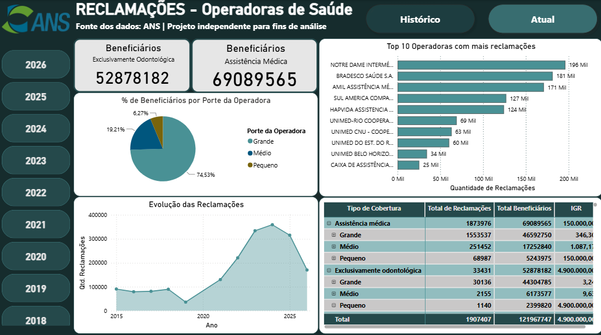
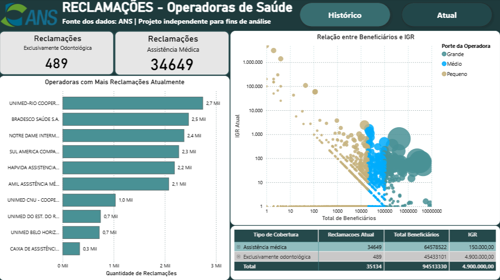
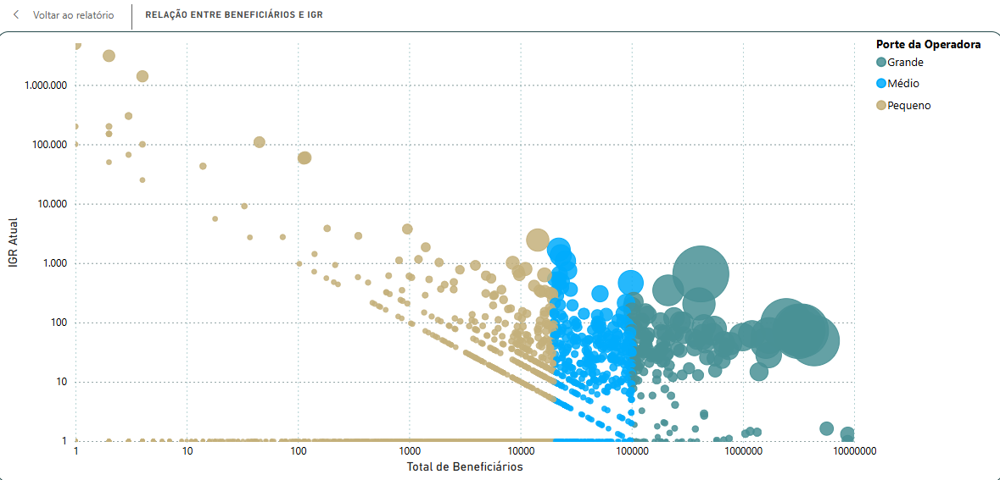

# IGR - Índice Geral de Reclamações <br>      Análise de Reclamações de Operadoras de Saúde

Dashboard desenvolvido em **Power BI** para análise de reclamações de operadoras de planos de saúde, utilizando dados públicos disponibilizados pela **Agência Nacional de Saúde Suplementar (ANS)**.

### Cálculo do IGR 

O IGR é calculado a partir da relação entre a média das Demandas NIP classificadas como: _Inativa, NP, RVE, Núcleo_ ou _Em Andamento_ no período analisado e a média de beneficiários de planos de saúde no mesmo período.


$$\left( \frac{\text{Média de demandas NIP no período}}{\text{Média de beneficiários no período}} \right)\times 100.000$$

**Fonte:** Ficha Técnica do indicador disponibilizada pela ANS.

---

## 📌 Visão geral

Este projeto tem como objetivo explorar e visualizar indicadores relacionados às reclamações de operadoras de saúde, permitindo analisar diferentes características e identificar padrões nos dados.

O dashboard foi desenvolvido buscando transformar os dados brutos em informações mais fáceis de interpretar por meio de indicadores, filtros e visualizações interativas.

---

## 🖥️ Dashboard

### Visão geral - Histórico



### Visão geral - Atual



### Análise de dispersão



> ⚠️ **Observação!**
> O gráfico de dispersão apresenta, tanto no eixo X como no eixo Y, a aplicação da escala logarítmica, utilizada apenas por conveniência de visualização, não afetando em nenhum grau os valores das variáveis utilizadas em ambos. 

---

## 🎯 Objetivos da análise

- Analisar a distribuição das reclamações entre as operadoras;
- Observar dados históricos e atuais;
- Comparar diferentes tipos de cobertura;
- Observar a relação entre quantidade de beneficiários e reclamações;
- Analisar o Índice de Reclamações (IGR);
- Identificar operadoras com maiores volumes de reclamações;
- Permitir análises segmentadas por características das operadoras e por datas.

---

## 📊 Principais indicadores

O dashboard apresenta indicadores como:

- **Quantidade de reclamações**
- **Quantidade de beneficiários**
- **Índice Geral de Reclamações (IGR)**
- **Porte da operadora**
- **Tipo de cobertura**
- **Competência dos dados**

---

## 🔎 Tratamento dos dados

Durante o desenvolvimento do projeto foram realizados tratamentos para adequar os dados ao modelo de análise.

Entre eles:

- Ajustes de tipos de dados e localidades;
- Tratamento de valores numéricos;
- Identificação da competência mais recente disponível para cada operadora;
- Criação de medidas DAX para evitar a duplicidade de informações;
- Utilização do valor mais recente de beneficiários por operadora;
- Utilização do valor mais recente do IGR por operadora;
- Utilização da competência mais recente para análise das reclamações e do IGR.

---

## 🧮 Medidas e lógica utilizadas

Uma das principais preocupações do projeto foi evitar que informações repetidas fossem somadas incorretamente.

Por exemplo, a quantidade de beneficiários pode aparecer repetida em diferentes registros da mesma operadora. Por isso, foram utilizadas medidas DAX para considerar a informação correspondente à competência mais recente, trazendo desse modo a quantidade de beneficiários mais atual.

### Total de Beneficiários 

```DAX
Total Beneficiários = 
SUMX(
    SUMMARIZE(
        'IGR',
        'IGR'[REGISTRO_OPERADORA],
        'IGR'[COBERTURA],
        'IGR'[PORTE_OPERADORA]
    ),
    VAR UltimaCompetencia =
        CALCULATE(
            MAX('IGR'[COMPETENCIA_BENEFICIARIO])
        )
    RETURN
        CALCULATE(
            MAX('IGR'[QTD_BENEFICIARIOS]),
            'IGR'[COMPETENCIA_BENEFICIARIO] = UltimaCompetencia
        )
)
```

## Último IGR registrado na base (por operadora)

```DAX
Último IGR = 
VAR UltimaCompetencia =
    MAX('IGR'[COMPETENCIA])
RETURN
    CALCULATE(
        MAX('IGR'[IGR]),
        'IGR'[COMPETENCIA] = UltimaCompetencia
    )
```

## 🔗 Links

- [Base de dados](https://dados.gov.br/dados/conjuntos-dados/indice-geral-de-reclamacoes---igr--metodologia-a-partir-de-2023)
- [Meu portfólio](https://brunaelen.github.io/portfolio/)
- [LinkedIn](www.linkedin.com/in/bruna-nascimento-dt-science)

> ⚠️ **Projeto independente!**
> Este dashboard não representa uma publicação ou ferramenta oficial da ANS.
